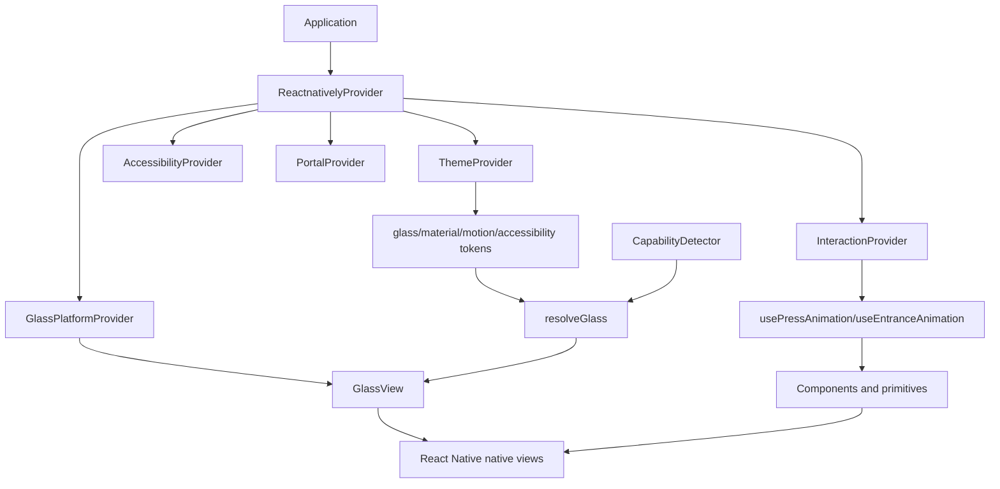
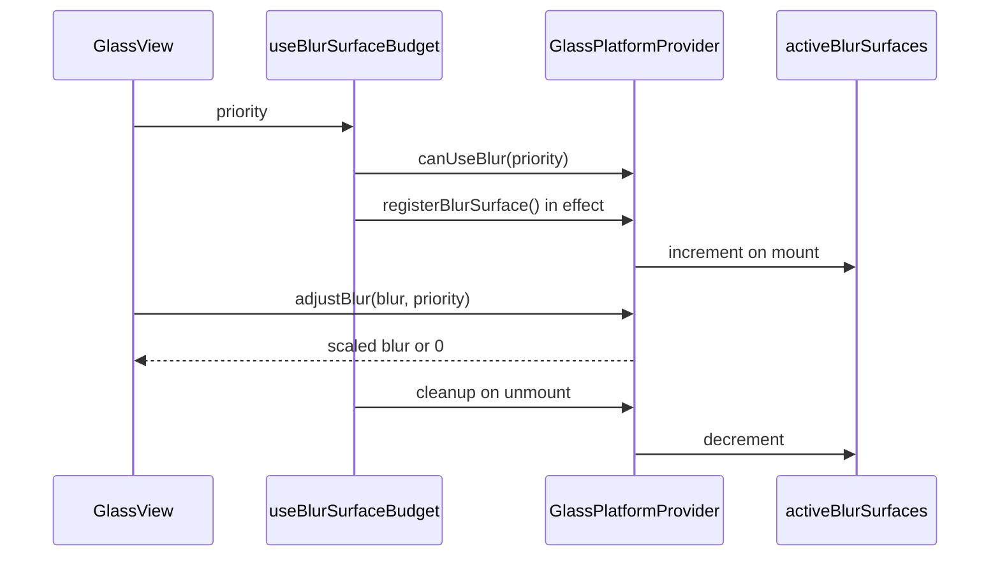
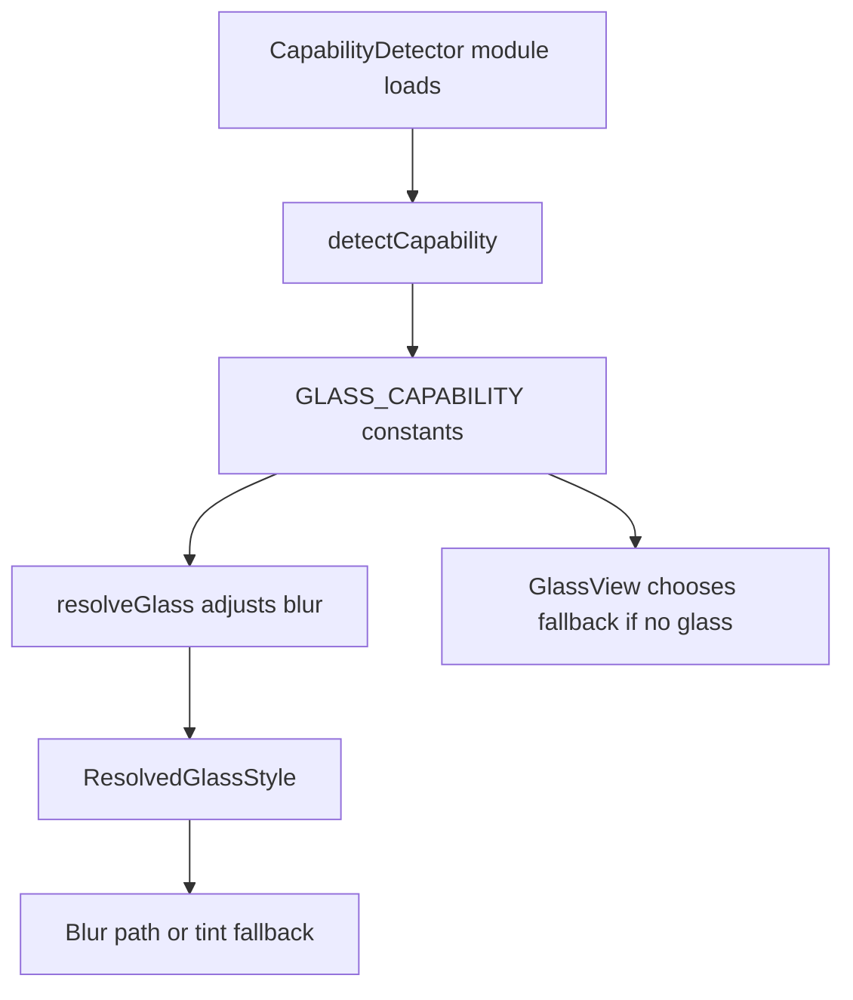
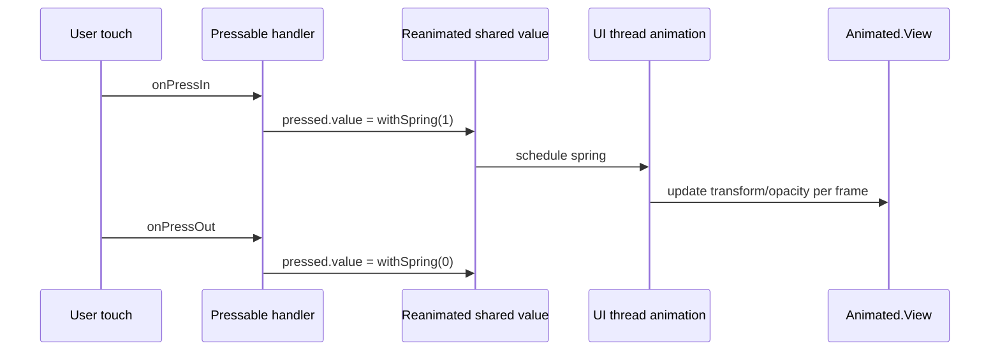

# ReactNatively Core Runtime Systems

An internal engineering handbook for the systems that make ReactNatively behave like a framework rather than a pile of components.

This document is intentionally narrower and deeper than *The ReactNatively Book*. It focuses on the runtime machinery: glass capability detection, GPU-aware blur budgeting, Reanimated-backed motion, package-level tree shaking, Expo compatibility, TypeScript system design, and accessibility architecture.

Read this when you are about to modify internals.

Read it again when a screen looks beautiful but drops frames.

Read it before adding a new provider, new rendering tier, new motion primitive, new package export, or new accessibility policy.

---

# 1. The Runtime Philosophy

ReactNatively is visually ambitious. It wants glass, motion, depth, translucency, haptics, overlays, and cinematic interaction. But React Native is not an infinite canvas. Every visual choice spends resources:

- CPU time to reconcile and layout views
- JS thread time to run React and event handlers
- UI thread time to drive native updates
- GPU time to composite layers, blur backgrounds, clip rounded corners, draw shadows, and animate transforms
- memory bandwidth to sample pixels and move frame buffers around
- battery life to sustain the work

The core runtime systems exist because the framework refuses to let premium visuals become accidental performance debt.

The architectural idea is simple:

> A serious visual framework should know what the device can do, budget expensive effects, run motion where frames can stay consistent, and degrade before the user feels pain.

That gives ReactNatively four runtime responsibilities:

1. **Capability**: decide what kind of rendering the platform can support.
2. **Budget**: decide how much expensive rendering the current tree may use.
3. **Motion**: move visual state on the UI thread when possible.
4. **Fallback**: preserve visual identity when native capabilities are missing.

These responsibilities are implemented across a few key files:

```text
packages/glass/src/engine/CapabilityDetector.ts
packages/glass/src/engine/GlassMaterialProvider.tsx
packages/glass/src/engine/GlassEngine.ts
packages/glass/src/components/GlassView/GlassView.tsx
packages/animations/src/InteractionProvider.tsx
packages/animations/src/hooks/usePressAnimation.ts
packages/animations/src/hooks/useEntranceAnimation.ts
packages/animations/src/hooks/useReducedMotion.ts
packages/theme/src/tokens/motion.ts
packages/theme/src/tokens/glass.ts
packages/theme/src/tokens/materials.ts
packages/primitives/src/AccessibilityProvider/AccessibilityProvider.tsx
packages/core/src/providers/ReactnativelyProvider.tsx
```

The runtime systems are not independent. `GlassView` consumes capability, theme, budget, and optional native modules. `GlassPressable` consumes motion and surface rendering. `ReactnativelyProvider` wires policy into the app tree. `packages/core` exports the public API while `tsup` and package `exports` shape the distribution.

This is the map:



If you are becoming the long-term maintainer, this is the central habit: follow expensive behavior through the runtime systems before changing component code.

---

# 2. GPU-Aware Blur Budgeting

## 2.1 What GPU-Aware Blur Budgeting Means

GPU-aware blur budgeting means the framework treats blur as a scarce rendering resource.

Not every `GlassView` automatically deserves real native blur. Some surfaces are essential: a modal, a command palette, a navigation bar. Some are decorative: repeated cards in a scrolling list, low-priority background panels, nested surfaces inside already blurred containers. The runtime needs a way to preserve blur where it matters and reduce or disable it where it would cost more than it contributes.

In ReactNatively, the budgeting system lives here:

```text
packages/glass/src/engine/GlassMaterialProvider.tsx
```

The provider exports:

```ts
export type GlassQuality = 'full' | 'balanced' | 'efficient' | 'off';
export type GlassPowerMode = 'normal' | 'save';
export type GlassSurfacePriority = 'low' | 'normal' | 'high' | 'critical';
```

And the core policies:

```ts
export interface GlassMaterialPolicy {
  quality: GlassQuality;
  powerMode: GlassPowerMode;
  tintDensity: number;
  reduceTransparency: boolean;
  nestedGlassIntensity: number;
}

export interface RenderBudgetPolicy {
  maxBlurSurfaces: number;
  degradeStrategy: 'disable-low-priority-blur' | 'reduce-all-blur';
}
```

The default budget is:

```ts
const defaultBudget: RenderBudgetPolicy = {
  maxBlurSurfaces: 8,
  degradeStrategy: 'reduce-all-blur',
};
```

This is not a scientific universal constant. It is a conservative framework default: enough blur surfaces for typical premium UI chrome, not enough to let a large list blur every row without consequence.

## 2.2 Why Blur Surfaces Are Expensive

A normal opaque view is comparatively cheap. The renderer draws it, and it covers what is behind it.

A blur surface is different. It depends on pixels behind it. Conceptually, the compositor must:

1. know what content lies behind the surface
2. sample that region
3. apply a blur kernel or native blur effect
4. tint the result
5. clip it to the surface shape
6. composite borders, highlights, shadows, and content above it

The cost grows with:

- number of blur surfaces
- surface area
- blur radius/intensity
- overlapping blur layers
- animated backgrounds behind blur
- rounded clipping
- shadows and elevation
- device GPU class
- platform implementation quality

The worst case is a scrolling screen with many translucent blurred rows over changing content. That produces repeated sampling and composition while the frame budget is already under pressure from scroll events, layout, image decoding, and animations.

At 60 FPS, each frame has about 16.67 ms. At 120 FPS, each frame has about 8.33 ms. A visually rich screen can spend that time quickly.

## 2.3 Why Low-End Android Struggles

Android is fragmented across OS versions, GPU vendors, device memory bandwidth, OEM rendering behavior, and React Native runtime versions. Older Android versions do not provide the same reliable blur primitives as iOS. Even when blur exists, quality and cost can vary.

ReactNatively therefore does two things:

1. It classifies older Android as no-glass in `CapabilityDetector.ts`.
2. It gives Android 12+ only partial glass by default.

The relevant logic:

```ts
function detectCapability(): GlassCapability {
  if (IS_IOS) return 'full';
  if (IS_ANDROID) {
    const version = getAndroidVersion();
    return version >= 31 ? 'partial' : 'none';
  }
  if (IS_WEB) return 'partial';
  return 'none';
}
```

This means low-end or older Android devices avoid native blur by default and render the fallback material path. That is a deliberate product decision: a stable designed fallback is better than an ambitious effect that makes the app feel broken.

## 2.4 The Blur Surface Lifecycle

A blur surface lifecycle begins when a component renders `GlassView`.

`GlassView` calls:

```ts
const glassPlatform = useGlassPlatform();
const withinBlurBudget = useBlurSurfaceBudget(priority);
```

`useBlurSurfaceBudget` does two things:

```ts
export function useBlurSurfaceBudget(priority: GlassSurfacePriority = 'normal'): boolean {
  const { canUseBlur, registerBlurSurface } = useGlassPlatform();

  useEffect(() => registerBlurSurface(), [registerBlurSurface]);

  return canUseBlur(priority);
}
```

The surface registers itself on mount and unregisters on unmount through the cleanup returned by `registerBlurSurface`.

Inside the provider:

```ts
const registerBlurSurface = useCallback(() => {
  setActiveBlurSurfaces((count) => count + 1);
  return () => {
    if (!mounted.current) return;
    setActiveBlurSurfaces((count) => Math.max(0, count - 1));
  };
}, []);
```

The runtime state is simple:

```ts
activeBlurSurfaces: number
```

This simple number powers the budget decision.



## 2.5 Prioritization

Budgeting becomes useful only when surfaces have priority.

ReactNatively defines:

- `low`
- `normal`
- `high`
- `critical`

In `canUseBlur`:

```ts
const canUseBlur = useCallback(
  (priority: GlassSurfacePriority = 'normal') => {
    if (resolvedMaterial.quality === 'off' || resolvedMaterial.reduceTransparency) {
      return false;
    }
    if (priority === 'critical' || priority === 'high') return true;
    return activeBlurSurfaces < resolvedBudget.maxBlurSurfaces;
  },
  [activeBlurSurfaces, resolvedBudget.maxBlurSurfaces, resolvedMaterial],
);
```

The policy says:

- if glass quality is `off`, no blur
- if transparency is reduced, no blur
- if priority is high or critical, allow blur
- otherwise, allow blur only if active surfaces are below the budget

This matches real UI hierarchy. A modal or top navigation surface can keep blur even when a low-priority card loses it.

### Practical Priority Guidance

Use `critical` for UI whose material identity is essential to understanding the screen, such as modal overlays or command layers.

Use `high` for persistent chrome like navigation bars, floating docks, or primary sheets.

Use `normal` for ordinary glass surfaces.

Use `low` for repeated or decorative surfaces, especially in lists.

Do not mark everything `high`. That is equivalent to turning the budget off.

## 2.6 Degradation

After capability detection and budget admission, `GlassView` still asks the provider to adjust blur:

```ts
blurAmount: withinBlurBudget
  ? glassPlatform.adjustBlur(glassStyle.blurAmount, priority)
  : 0,
```

`adjustBlur` applies quality, power, and budget scaling:

```ts
const qualityScalar =
  resolvedMaterial.quality === 'full'
    ? 1
    : resolvedMaterial.quality === 'balanced'
      ? 0.82
      : resolvedMaterial.quality === 'efficient'
        ? 0.55
        : 0;

const powerScalar = resolvedMaterial.powerMode === 'save' ? 0.68 : 1;

const budgetScalar =
  resolvedBudget.degradeStrategy === 'reduce-all-blur' &&
  activeBlurSurfaces > resolvedBudget.maxBlurSurfaces
    ? resolvedBudget.maxBlurSurfaces / Math.max(activeBlurSurfaces, 1)
    : 1;

return Math.round(blur * qualityScalar * powerScalar * budgetScalar);
```

There are two kinds of degradation:

1. **Admission degradation**: low/normal surfaces may get blur `0` if over budget.
2. **Scalar degradation**: all admitted surfaces may get reduced blur depending on quality, power mode, and budget pressure.

This is an elegant compromise. The system can both preserve high-value surfaces and lower global cost when the tree becomes heavy.

## 2.7 Render Path After Degradation

Once blur resolves to zero, `GlassView` takes the fallback path:

```ts
if (IS_NO_GLASS || resolved.blurAmount === 0) {
  return (
    <View style={[styles.shadowShell, { borderRadius }, shadowStyle, style]}>
      <View style={[styles.clipShell, { borderRadius }]}>
        <View style={[StyleSheet.absoluteFill, { backgroundColor: resolved.tintColor }]} />
        {/* highlight, border, content */}
      </View>
    </View>
  );
}
```

This is crucial. Degradation does not remove the component. It removes the expensive native blur while preserving:

- tint
- highlight
- border
- shadow/elevation
- content
- rounded shape

The user still sees a designed surface.

## 2.8 Memory And Composition Implications

Blur can increase memory bandwidth because the compositor may need intermediate buffers for the region behind the blur. Large blur areas can require larger offscreen surfaces. Multiple overlapping blur layers can multiply composition work. Rounded clipping and shadows can add more render passes or special-case GPU work depending on platform.

ReactNatively does not currently calculate memory cost by area. It budgets by count. Count is a coarse approximation, but it is cheap and predictable.

Future versions could track:

- approximate surface area via layout measurement
- viewport intersection
- nesting depth
- animation state
- device tier

Do not add this complexity until there is profiling evidence. A simple budget that works is better than a clever budget that becomes a source of bugs.

## 2.9 Debugging Blur Performance

When glass hurts performance, use this process:

1. **Count surfaces**: how many `GlassView`s are visible?
2. **Classify surfaces**: which are critical, high, normal, low?
3. **Check capability**: what is `GLASS_CAPABILITY`?
4. **Check provider policy**: quality, power mode, reduce transparency, max blur surfaces.
5. **Check repeated UI**: are lists rendering glass per row?
6. **Check animation**: are transforms/opacity animated, or is blur intensity changing?
7. **Check optional modules**: is `expo-blur` installed and working?
8. **Check Android version**: old Android should not be forced into native blur.

An example provider tuning for a heavy screen:

```tsx
<ReactnativelyProvider
  glass={{
    material: { quality: 'efficient', powerMode: 'save' },
    budget: { maxBlurSurfaces: 4, degradeStrategy: 'reduce-all-blur' },
  }}
>
  <HeavyScreen />
</ReactnativelyProvider>
```

## 2.10 What Breaks If Implemented Incorrectly

If registration leaks, `activeBlurSurfaces` grows forever. Eventually normal surfaces degrade even when few are visible.

If registration does not happen, every surface believes the budget is empty and blur becomes unbounded.

If all surfaces bypass priority as `high`, the budget loses meaning.

If fallback rendering is removed, low-end Android becomes visually broken.

If quality scalars are applied before capability detection incorrectly, partial/no-glass platforms may still attempt unsupported blur.

If provider state updates during unmount without guarding mounted state, React can warn about state updates after unmount. The current `mounted` ref exists to avoid that.

## 2.11 How To Evolve Blur Budgeting Safely

When modifying this system:

1. Keep `GlassPlatformProvider` the policy owner.
2. Keep `CapabilityDetector` platform-focused.
3. Keep `resolveGlass` pure.
4. Keep `GlassView` responsible for render path selection.
5. Preserve fallback rendering.
6. Add new budget concepts as optional policy fields.
7. Do not introduce per-frame React state.
8. Test with many mounted `GlassView`s.
9. Test old Android behavior.
10. Test missing `expo-blur`.

Safe additions:

- new quality level
- device-tier scalar
- battery-aware scalar
- area-aware future budget hook
- nested glass reduction

Risky additions:

- animating blur as default behavior
- measuring every surface every frame
- global mutable counters outside React lifecycle
- making optional modules required
- bypassing fallback path for visual purity

---

# 3. Capability-First Rendering

## 3.1 What Capability-First Rendering Means

Capability-first rendering means the framework chooses rendering strategy based on what the platform can reliably support before it tries to draw.

It is the opposite of optimistic rendering.

Optimistic rendering says: "Try blur everywhere and see what happens."

Capability-first rendering says: "Classify this platform once, then choose the correct render path consistently."

ReactNatively's capability system lives in:

```text
packages/glass/src/engine/CapabilityDetector.ts
```

It exports:

```ts
export const GLASS_CAPABILITY: GlassCapability = detectCapability();
export const SUPPORTS_BLUR: boolean = GLASS_CAPABILITY !== 'none';
export const IS_FULL_GLASS: boolean = GLASS_CAPABILITY === 'full';
export const IS_PARTIAL_GLASS: boolean = GLASS_CAPABILITY === 'partial';
export const IS_NO_GLASS: boolean = GLASS_CAPABILITY === 'none';
```

These constants are runtime facts for the current app session.

## 3.2 Why Detection Happens Once

Capability detection is done at module initialization:

```ts
export const GLASS_CAPABILITY: GlassCapability = detectCapability();
```

That means detection runs when the module is evaluated, not inside every render.

This is intentional.

React rendering should be predictable and cheap. You do not want every `GlassView` to repeatedly ask the platform whether blur is supported. Platform capability generally does not change while the app is running. A modern Android device does not become iOS mid-session.

Doing detection once gives:

- consistent render paths
- fewer repeated checks
- easier debugging
- stable exports for custom components
- no per-render platform heuristics

## 3.3 Why Runtime Render-Path Checks Can Be Dangerous

Some runtime checks are necessary. For example, `GlassView` checks whether `expo-blur` was successfully loaded. But platform capability should not become a complex per-render decision.

Dangerous runtime checks include:

- probing native blur support during render
- measuring frame rate and changing render paths every few frames
- switching between blur and fallback rapidly during interaction
- performing async capability checks that cause hydration-like visual changes

These can produce flicker, inconsistent UI, and hard-to-debug state.

Proactive degradation is better than reactive lag. The user should see a stable designed fallback immediately rather than a beautiful surface that stutters, fails, and then downgrades.

## 3.4 Platform Strategy

The current strategy:

```ts
if (IS_IOS) return 'full';
if (IS_ANDROID) {
  const version = getAndroidVersion();
  return version >= 31 ? 'partial' : 'none';
}
if (IS_WEB) return 'partial';
return 'none';
```

### iOS

iOS is treated as full glass because native blur and shadows are generally more consistent and visually aligned with the framework's material goals.

### Android 12+

Android version 31+ is partial because blur support is more plausible but not equivalent to iOS in reliability or cost. ReactNatively reduces blur intensity:

```ts
if (GLASS_CAPABILITY === 'partial') return Math.round(intensity * 0.65);
```

### Older Android

Older Android is no glass. This avoids forcing expensive or unsupported blur into devices least likely to handle it well.

### Web

Web is partial. Even though CSS can support backdrop blur, React Native Web environments vary, and this framework's primary runtime is React Native/Expo. Partial is a conservative classification.

## 3.5 Capability Flow Into Rendering



The constants influence two places:

1. `resolveGlass` scales blur through `adjustBlurForCapability`.
2. `GlassView` checks `IS_NO_GLASS` and falls back.

This split is important. The resolver determines material values. The renderer chooses actual layer structure.

## 3.6 Fallback Rendering Internals

Fallback does not mean plain `View`.

In fallback mode, `GlassView` still renders:

- shadow shell
- clip shell
- tint overlay
- highlight
- border
- content

It simply does not render native `BlurView`.

This allows fallback surfaces to preserve hierarchy and identity even without true background blur.

## 3.7 Extending Capability Detection

If you add new tiers, be careful. For example:

```ts
export type GlassCapability = 'full' | 'partial' | 'tint-only' | 'none';
```

You would need to update:

- `CapabilityDetector.ts`
- `adjustBlurForCapability`
- exported booleans
- `GlassEngine.types.ts`
- `resolveGlass`
- `GlassView` render paths
- docs and tests
- any custom component using capability constants

Do not add a tier only because it feels conceptually nice. Add it when the renderer needs a distinct behavior.

Possible future tiers:

- `full`: native blur, full intensity
- `partial`: native blur, reduced intensity
- `static`: blur allowed only for non-animated or non-scrolling surfaces
- `tint-only`: no blur, but full material fallback
- `none`: minimal material fallback

## 3.8 Debugging Capability Issues

Symptoms:

- iOS unexpectedly shows fallback.
- Android blur is too intense.
- older Android tries to blur.
- custom component thinks blur is available when it is not.

Checklist:

1. Inspect `IS_IOS`, `IS_ANDROID`, `IS_WEB` from `reactnatively-utils`.
2. Inspect `getAndroidVersion`.
3. Log `GLASS_CAPABILITY`.
4. Confirm import path uses the built package you expect.
5. Confirm platform-specific Metro resolution is not stale.
6. Confirm `expo-blur` is installed if native blur is expected.
7. Confirm `GlassPlatformProvider` is not disabling blur through policy.

## 3.9 What Breaks If Implemented Incorrectly

If detection is too optimistic, unsupported devices get expensive or broken rendering.

If detection is too pessimistic, capable devices lose visual quality.

If detection changes during runtime without careful transition design, the UI can flicker or remount expensive layers.

If capability constants are not exported consistently, app developers and internal components will build incompatible assumptions.

If fallback paths diverge too far from full glass paths, the UI identity splits by platform.

---

# 4. Reanimated-Backed Motion System

## 4.1 Why Motion Runs On The UI Thread

React Native has at least two important worlds:

- the JavaScript world, where React components, state, and business logic run
- the native/UI world, where frames are committed and gestures must feel immediate

If every animation depends on the JS thread, then animations compete with:

- React renders
- data processing
- network callbacks
- logging
- JSON parsing
- expensive user code

When the JS thread stalls, JS-driven animations can stutter.

Reanimated allows animation worklets and shared values to update on the UI thread. That keeps press feedback and transitions responsive even when JavaScript is busy.

In a glass-heavy framework, this matters even more. The GPU may already be busy compositing translucent layers. You cannot also afford late animation scheduling.

## 4.2 Motion File Map

Motion tokens:

```text
packages/theme/src/tokens/motion.ts
```

Reanimated presets:

```text
packages/animations/src/presets/spring.ts
packages/animations/src/presets/timing.ts
```

Shared hooks:

```text
packages/animations/src/hooks/usePressAnimation.ts
packages/animations/src/hooks/useEntranceAnimation.ts
packages/animations/src/hooks/useReducedMotion.ts
```

Global interaction policy:

```text
packages/animations/src/InteractionProvider.tsx
```

Core motion components:

```text
packages/core/src/components/motion/Fade/Fade.tsx
packages/core/src/components/motion/Scale/Scale.tsx
packages/core/src/components/motion/Slide/Slide.tsx
packages/core/src/components/motion/BlurTransition/BlurTransition.tsx
packages/core/src/components/motion/MagneticPressable/MagneticPressable.tsx
```

Interactive primitive:

```text
packages/primitives/src/GlassPressable/GlassPressable.tsx
```

## 4.3 Tokens To Presets

`packages/theme/src/tokens/motion.ts` defines durations, easing curves, springs, and reduced-motion equivalents.

Springs:

- `snappy`
- `liquid`
- `reveal`
- `bounce`
- `precise`

`packages/animations/src/presets/spring.ts` converts token springs into Reanimated configs:

```ts
export const SPRING_SNAPPY: WithSpringConfig = springTokens.snappy;
export const SPRING_LIQUID: WithSpringConfig = springTokens.liquid;
```

Timing presets do the same with easing:

```ts
export const TIMING_FAST: WithTimingConfig = {
  duration: durationTokens.fast,
  easing: bezier(easingTokens.standard),
};
```

The token package defines intent. The animation package adapts that intent to Reanimated.

## 4.4 Interaction Provider

`InteractionProvider` gives the app a global interaction personality:

```ts
const defaultPolicy: InteractionPolicy = {
  intensity: 'standard',
  enableHaptics: true,
  pressScale: stateTokens.pressed.scale,
  pressOpacity: stateTokens.pressed.opacity,
  defaultSpring: 'snappy',
};
```

It exposes:

```ts
resolveSpring
resolvePress
resolveHaptic
```

The important one for visual motion is `resolvePress`:

```ts
resolvePress: (scale, opacity) => {
  const targetScale = scale ?? resolvedPolicy.pressScale;
  const targetOpacity = opacity ?? resolvedPolicy.pressOpacity;
  return {
    scale: 1 - (1 - targetScale) * intensityScalar,
    opacity: 1 - (1 - targetOpacity) * intensityScalar,
  };
}
```

This allows one component to adapt to subtle, standard, or expressive interaction without changing its own implementation.

## 4.5 Press Animation Internals

`usePressAnimation`:

```ts
const pressed = useSharedValue(0);
```

Then:

```ts
const animatedStyle = useAnimatedStyle((): ViewStyle => {
  'worklet';
  if (disabled || isReduced) return {};
  return {
    transform: [
      { scale: interpolate(pressed.value, [0, 1], [1, resolvedPress.scale]) },
    ],
    opacity: interpolate(pressed.value, [0, 1], [1, resolvedPress.opacity]),
  };
});
```

Handlers update shared values:

```ts
onPressIn: () => {
  'worklet';
  pressed.value = withSpring(1, springConfig);
},
onPressOut: () => {
  'worklet';
  pressed.value = withSpring(0, springConfig);
},
```

The flow:



React state does not participate in the per-frame updates.

## 4.6 Gesture Motion

`MagneticPressable` measures layout once and stores it in a ref:

```ts
layoutRef.current = { width: w, height: h, pageX: x, pageY: y };
```

On responder movement, it computes offset and updates shared values:

```ts
translateX.value = withSpring(offsetX, SPRING_BOUNCE);
translateY.value = withSpring(offsetY, SPRING_BOUNCE);
```

This avoids React re-renders during gesture movement.

Gesture-driven components should follow the same rule:

- React state for semantic state
- shared values for frame-by-frame visual state
- refs for mutable measurements

## 4.7 Motion And Glass

The framework generally animates wrappers around glass, not the blur itself.

For example:

- `LiquidCard` animates scale around `GlassView`.
- `GlassPressable` animates an `Animated.View` around `Surface`.
- `Button` animates the pressable wrapper.

This is correct because transforms and opacity are usually cheaper and more predictable than animating native blur intensity. A blurred view that scales as a composited layer is much safer than a blur kernel that changes every frame.

## 4.8 Worklets And Captures

Inside `useAnimatedStyle`, the function becomes a worklet. It should avoid capturing complex JS objects that cannot safely cross into the UI runtime.

Good:

```ts
const animatedStyle = useAnimatedStyle(() => {
  'worklet';
  return { opacity: progress.value };
});
```

Risky:

```ts
const animatedStyle = useAnimatedStyle(() => {
  'worklet';
  analytics.track('frame');
  return computeHugeStyleFromTheme(theme);
});
```

Use worklets for animation math, not arbitrary application behavior.

## 4.9 What Breaks If Implemented Incorrectly

If press animation uses React state, feedback can lag under JS load.

If worklets capture unstable objects, animations can break or rebuild unnecessarily.

If reduced motion is ignored, the framework becomes inaccessible for motion-sensitive users.

If glass blur is animated instead of transforms, FPS can collapse on lower-end devices.

If Reanimated Babel plugin is missing, worklets may fail or run incorrectly.

## 4.10 How To Evolve Motion Safely

When adding motion:

1. Put reusable timing/spring values in tokens.
2. Expose Reanimated-ready presets in `packages/animations`.
3. Add hooks for reusable behavior.
4. Keep component-specific orchestration in components.
5. Respect reduced motion.
6. Avoid per-frame React state.
7. Animate transforms and opacity before layout or blur.
8. Test with JS thread under load.

---

# 5. Tree-Shakeable Package Architecture

## 5.1 What Tree Shaking Actually Means

Tree shaking is dead code elimination for module graphs. If a consumer imports only `Button`, a bundler should avoid including unrelated code when it can prove that code is unused and has no side effects.

Tree shaking depends on:

- ESM syntax
- static imports/exports
- package `sideEffects` metadata
- bundler analysis
- avoiding top-level behavior that must be preserved

ReactNatively supports this through package structure and build configuration.

## 5.2 Package Build Shape

Each package has:

```json
"main": "./dist/index.js",
"module": "./dist/index.mjs",
"types": "./dist/index.d.ts",
"sideEffects": false
```

`packages/core/package.json` also has subpath exports:

```json
"./glass": {
  "types": "./dist/glass.d.ts",
  "import": "./dist/glass.mjs",
  "require": "./dist/glass.js"
}
```

The core tsup config:

```ts
export default defineConfig({
  entry: [
    'src/index.ts',
    'src/glass.ts',
    'src/hooks.ts',
    'src/animations.ts',
    'src/theme.ts',
    'src/primitives.ts',
    'src/utils.ts',
  ],
  format: ['cjs', 'esm'],
  dts: true,
  sourcemap: true,
  clean: true,
  treeshake: true,
  splitting: true,
  external: [
    'react',
    'react-native',
    'expo-blur',
    'react-native-gesture-handler',
    'react-native-linear-gradient',
    'react-native-reanimated',
  ],
});
```

## 5.3 Why Modular Packages Matter

The package split gives maintainers clear dependency boundaries. It also gives bundlers smaller conceptual chunks.

`reactnatively-theme` does not need to import `reactnatively-glass`.

`reactnatively-utils` should not import React contexts.

`reactnatively-animations` can be consumed without importing every component.

This reduces accidental dependency drag.

## 5.4 Barrels Can Help Or Hurt

A barrel file like `packages/core/src/index.ts` is convenient. But barrels can hurt tree shaking if they import modules with top-level side effects or if bundlers cannot prove unused exports are safe to drop.

ReactNatively mitigates this with:

- `sideEffects: false`
- ESM output
- subpath entries
- guarded optional requires inside functions/components
- external native peers

Still, future maintainers must be careful.

Avoid top-level code like:

```ts
initializeNativeThing();
```

in files exported by public barrels.

Prefer lazy guarded loading:

```ts
function loadOptionalModule() {
  try {
    return require('optional-module');
  } catch {
    return null;
  }
}
```

## 5.5 Metro And Expo Reality

Metro historically behaves differently from web bundlers like Rollup, Vite, or webpack. React Native bundling is improving, but you should not assume all ESM tree-shaking behavior is identical across environments.

For React Native and Expo:

- package exports matter
- CJS/ESM compatibility matters
- peer dependencies matter
- duplicate React Native packages can break runtime
- optional native modules must not crash at import time

The playground Metro config pins singletons because monorepos can accidentally resolve duplicate copies:

```js
const singletons = {
  'react': path.resolve(projectRoot, 'node_modules/react'),
  'react-native': path.resolve(projectRoot, 'node_modules/react-native'),
  'react-native-reanimated': path.resolve(projectRoot, 'node_modules/react-native-reanimated'),
  'reactnatively': path.resolve(projectRoot, 'node_modules/reactnatively'),
};
```

## 5.6 How Imports Affect Bundle Output

Best:

```ts
import { GlassView } from 'reactnatively/glass';
```

Good:

```ts
import { GlassView } from 'reactnatively';
```

Risky in future code:

```ts
import * as Reactnatively from 'reactnatively';
```

Namespace imports can make static analysis harder depending on bundler behavior.

Inside the framework, avoid importing from the public facade when a lower-level package can import the direct lower-level dependency. For example, `packages/primitives` should import `GlassView` from `reactnatively-glass`, not from `reactnatively`.

## 5.7 Debugging Bundle Growth

When bundle size grows unexpectedly:

1. Inspect new imports.
2. Check whether a public barrel now imports a heavy module.
3. Check if a dependency was added to `dependencies` instead of `peerDependencies`.
4. Check tsup output.
5. Check whether optional native modules became static imports.
6. Generate bundle analysis in the consuming app if available.
7. Compare before/after Metro bundle output.
8. Check whether `sideEffects` was removed or invalidated.

## 5.8 Safe Export Strategy

When exposing a new API:

1. Export from local file.
2. Export from package `src/index.ts`.
3. Export from core facade if public.
4. Add subpath export only if it belongs to a focused API group.
5. Ensure tsup entry exists.
6. Ensure package `exports` maps generated files.
7. Keep types exported alongside values.

Do not expose internal helper functions simply because a component uses them.

---

# 6. Expo-First Architecture

## 6.1 Why Expo Compatibility Matters

Expo compatibility matters because Expo is the easiest path for many React Native teams to adopt a UI framework. If ReactNatively requires custom native setup for core visuals, adoption becomes harder.

Expo-first does not mean Expo-locked. It means the framework should work naturally in Expo while keeping fallbacks for bare React Native.

## 6.2 Expo Blur Integration

`GlassView` attempts to load `expo-blur`:

```ts
BlurViewImpl = require('expo-blur').BlurView;
```

If this fails, `BlurViewImpl` becomes null and `GlassView` renders the tint fallback.

This design means:

- Expo apps with `expo-blur` get native blur.
- Bare apps without `expo-blur` do not crash.
- Consumers can opt into richer rendering by installing the peer.

## 6.3 Expo Haptics

`GlassPressable` optionally loads `expo-haptics`:

```ts
const Haptics = require('expo-haptics') as typeof import('expo-haptics');
triggerHaptic = () => {
  Haptics.impactAsync(Haptics.ImpactFeedbackStyle.Light).catch(() => {});
};
```

If unavailable, haptic behavior is a no-op.

Haptics are enhancement, not foundation.

## 6.4 Avoiding Expo Lock-In

Expo-specific code should live at integration boundaries:

- `GlassView` optional blur loading
- `GlassPressable` optional haptics
- playground config

Core logic should remain plain React Native/TypeScript:

- token resolution
- capability detection
- provider policy
- component structure
- Reanimated motion

This keeps the framework portable.

## 6.5 Expo SDK Compatibility

Expo SDK versions can change native module behavior and peer dependency versions. To maintain compatibility:

1. Keep peer ranges reasonable.
2. Avoid relying on undocumented APIs.
3. Guard optional module loading.
4. Test playground against target Expo SDKs.
5. Keep Reanimated plugin configuration documented.
6. Avoid native code assumptions inside generic packages.

## 6.6 What Breaks If Implemented Incorrectly

Static importing `expo-blur` can crash apps where it is not installed.

Assuming haptics always exist can reject presses or throw promise errors.

Using Expo-only APIs deep in `theme` or `utils` would make non-Expo consumers pay for Expo assumptions.

Ignoring SDK version drift can produce confusing runtime bugs.

---

# 7. TypeScript-First System Design

## 7.1 Why Strict Typing Matters In Frameworks

Application code can sometimes tolerate loose types. Framework code cannot.

A framework API is used by many unknown consumers. Types become:

- documentation
- autocomplete
- guardrails
- migration support
- public contract

ReactNatively uses TypeScript to make tokens discoverable, props semantic, and subsystem boundaries explicit.

## 7.2 Token Inference

`createTheme`:

```ts
export function createTheme<T extends DeepPartial<BaseTheme>>(overrides: T): BaseTheme & T
```

This lets consumers pass partial overrides while retaining the full base theme shape.

`useToken<K extends keyof BaseTheme>(key: K): BaseTheme[K]` gives key-safe access to token families.

The goal is IntelliSense that teaches the system while you type.

## 7.3 Variant Typing

`defineVariants` in `packages/utils/src/variants.ts` supports typed variant maps. Components like `Button` and `Avatar` use it for size systems.

The pattern:

```ts
const SIZE_CONFIG = defineVariants<string, ButtonSizeConfig>({
  xs: { ... },
  sm: { ... },
});
```

The benefit is not only runtime lookup. It also encodes legal variant keys.

## 7.4 Component Contracts

Most components separate props into `Component.types.ts`. This keeps the public contract readable and prevents implementation files from becoming type jungles.

Good framework component folders:

```text
Button/
  Button.tsx
  Button.types.ts
  index.ts
```

If a type is public, export it. If it is implementation-only, keep it local.

## 7.5 Polymorphic Types

`packages/utils/src/types/polymorphic.ts` exists for polymorphic component patterns. `Slot` provides runtime support for render delegation. Together, these are the foundation for future `asChild` or polymorphic APIs.

Be careful: polymorphism improves flexibility but complicates types. Do not add `asChild` everywhere because it is fashionable. Add it where composition pressure is real.

## 7.6 Type Evolution Rules

When extending types:

1. Prefer additive changes.
2. Avoid widening semantic unions too casually.
3. Keep exported type names stable.
4. Use `DeepPartial` for theme overrides.
5. Export prop types from component indexes.
6. Keep internal helper types private.
7. Test TypeScript declarations after build.

What breaks if typing is careless:

- consumers lose autocomplete
- invalid token names compile
- public API becomes ambiguous
- future refactors become breaking changes
- docs and implementation drift

---

# 8. Accessibility Engineering

## 8.1 Why Accessibility Belongs At The Primitive Level

Accessibility cannot be sprinkled on at the end. If primitives ignore it, every component must solve it alone, and consistency collapses.

ReactNatively begins accessibility at:

```text
packages/primitives/src/AccessibilityProvider/AccessibilityProvider.tsx
```

The policy:

```ts
export interface AccessibilityPolicy {
  minTouchTarget: number;
  allowFontScaling: boolean;
  maxFontSizeMultiplier: number;
  reduceTransparency: boolean;
}
```

It exposes:

```ts
touchTargetStyle
textProps
```

This allows components to share minimum target and text scaling behavior.

## 8.2 Semantic Role Mapping

Components must set roles and states:

- `Button`: `accessibilityRole="button"`, disabled/busy state
- `Tabs.Tab`: `accessibilityRole="tab"`, selected/disabled state
- `LiquidCard` when pressable: button role
- `MagneticPressable`: button role

Roles tell assistive technology what an element is. State tells it what is happening.

Visual state without accessibility state is incomplete UI.

## 8.3 Reduced Motion

Reduced motion is handled in:

```text
packages/animations/src/hooks/useReducedMotion.ts
```

This hook returns Reanimated's reduced motion setting and maps tokens to reduced equivalents.

Motion primitives should use it. Components with direct animation should use it too.

## 8.4 Transparency And Contrast

Glass can hurt accessibility if it lowers contrast or makes background content interfere with foreground content. ReactNatively has:

- `accessibilityTokens.transparency.reducedTintOpacity`
- `accessibilityTokens.transparency.reducedBlur`
- `AccessibilityPolicy.reduceTransparency`
- `GlassMaterialPolicy.reduceTransparency`

The current architecture has the pieces, but the policy bridge can be improved. A future change should connect accessibility reduced transparency to glass provider material policy.

## 8.5 Focus Management

Focus management is still an area for future strengthening. Overlays, dialogs, command palettes, and menus should eventually manage:

- initial focus
- focus trapping where appropriate
- restoration on close
- escape/back behavior
- screen reader announcements

React Native accessibility APIs differ from web ARIA patterns, so this should be designed carefully per platform.

## 8.6 What Breaks If Accessibility Is Wrong

Buttons may be invisible to screen readers.

Tabs may not announce selection.

Loading controls may not announce busy state.

Motion may make users uncomfortable.

Glass may reduce readability.

Tiny touch targets may become unusable.

Accessibility bugs are framework bugs, not optional polish.

## 8.7 Safe Accessibility Evolution

1. Strengthen primitives first.
2. Consume `useAccessibilityPolicy` consistently.
3. Add role/state helpers if duplication grows.
4. Wire reduced transparency into glass policy deliberately.
5. Audit text scaling.
6. Add overlay focus management.
7. Test with screen readers.

---

# 9. GPU-Aware Design Philosophy

## 9.1 Beauty Under Constraint

Elite UI systems are not beautiful because they render everything at maximum intensity. They are beautiful because they know what to emphasize.

Maximum blur everywhere is bad architecture because:

- hierarchy disappears
- performance collapses
- battery drains
- low-end devices suffer
- visual novelty becomes noise

ReactNatively's philosophy is perceived quality, not brute-force rendering.

## 9.2 Adaptive Degradation Is Not Failure

A fallback is not a failure path. It is a designed alternate reality.

On a capable iPhone, glass may be full blur.

On Android 12+, it may be reduced blur.

On older Android, it may be tint, highlight, border, and shadow without native blur.

The user should never feel punished for their device.

## 9.3 Thinking Like A Rendering Systems Engineer

Ask:

- What is the visual job of this effect?
- Can the same job be done cheaper?
- Does this surface need real blur or just material hierarchy?
- Is this effect persistent, repeated, or animated?
- What happens on old Android?
- What happens under JS thread pressure?
- What happens when multiple overlays stack?
- Does this preserve accessibility?

## 9.4 Apple And visionOS Lessons, Carefully Applied

Apple-style glass and visionOS-like materials succeed because they are not just blur. They use hierarchy, lighting, depth, motion, and restraint. Materials communicate layer, focus, and environment.

ReactNatively cannot copy platform rendering wholesale. React Native does not expose the same compositor controls. But it can copy the discipline:

- semantic materials
- layered rendering
- adaptive quality
- motion tied to meaning
- fallback paths
- careful hierarchy

The goal is not to imitate a platform pixel-for-pixel. The goal is to build a cross-platform material system with taste.

## 9.5 The Maintainer's Final Rule

When choosing between a more impressive screenshot and a more stable runtime, choose the runtime.

A framework is not judged only at rest. It is judged under touch, scroll, load, old devices, missing peers, dark mode, reduced motion, and long sessions.

The best visual systems feel effortless because their engineering is disciplined.

ReactNatively's core runtime systems are that discipline.

