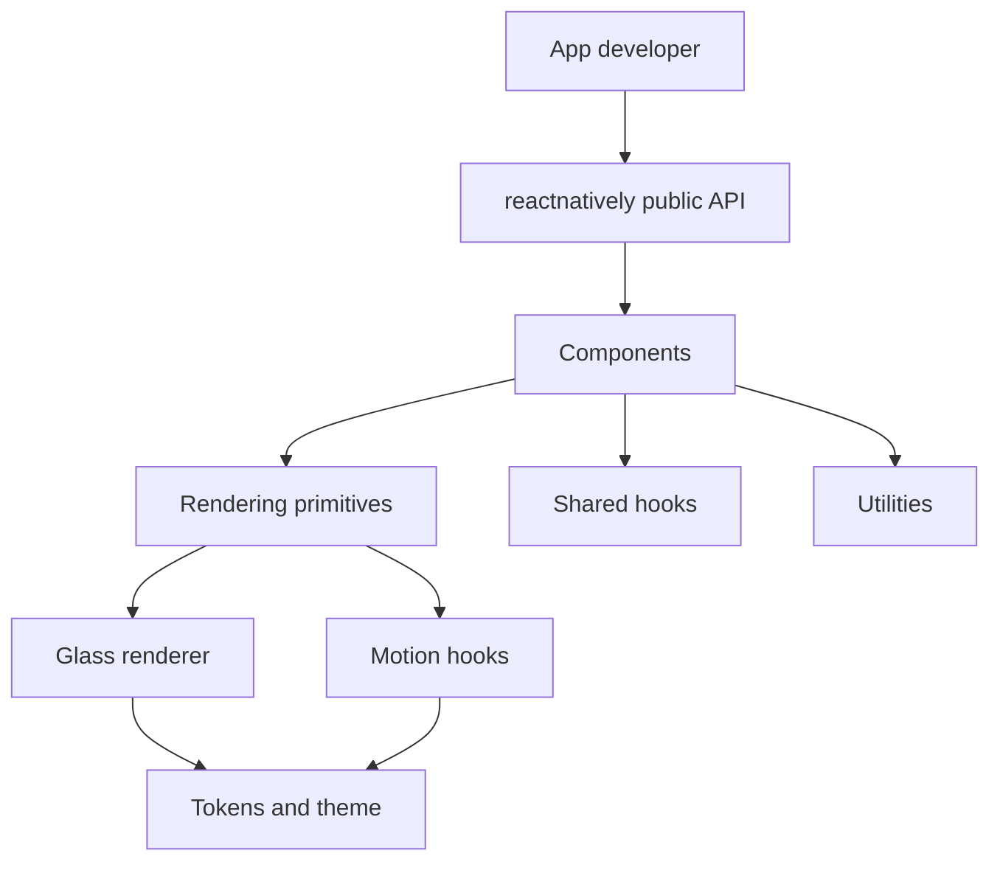
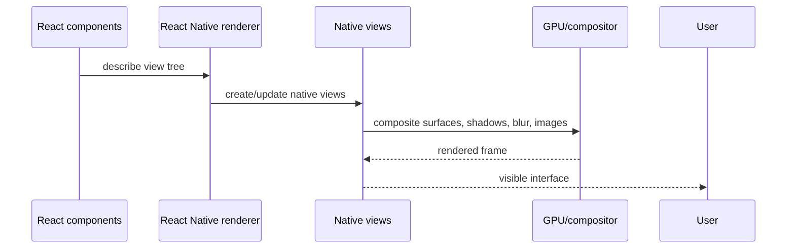
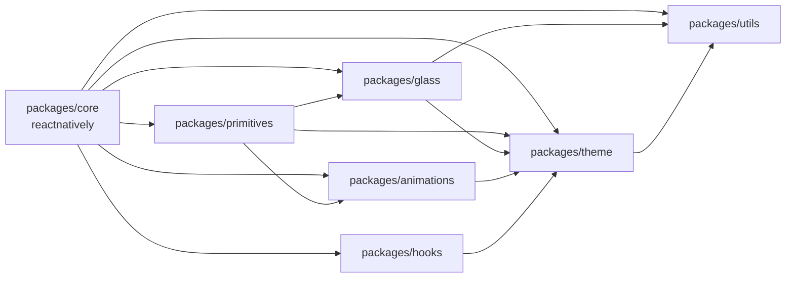
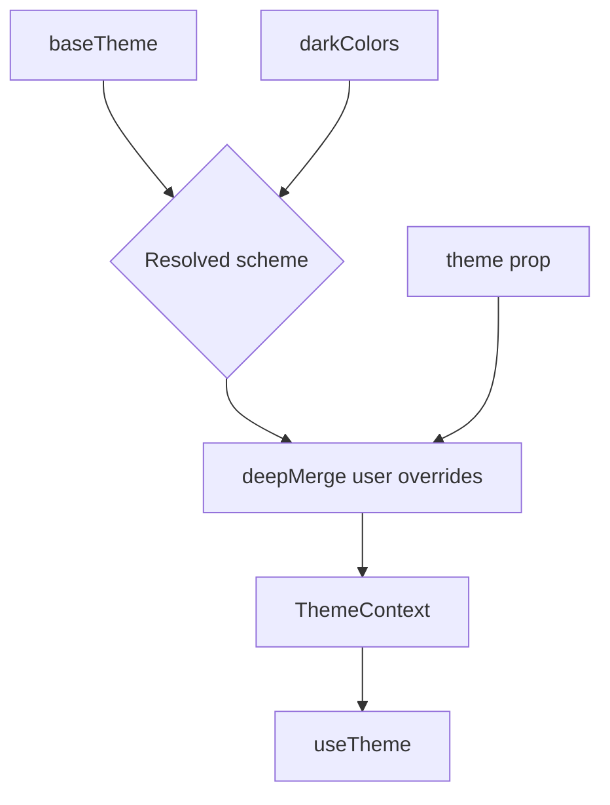
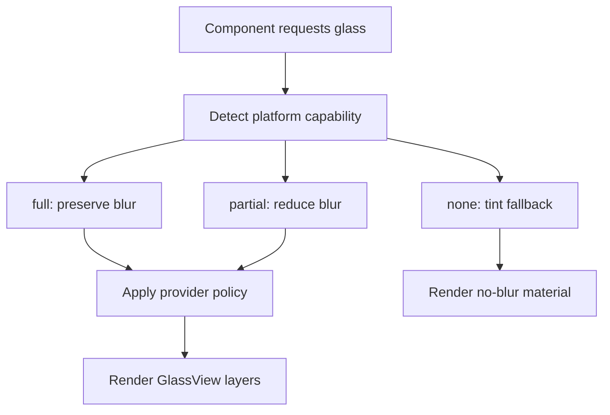
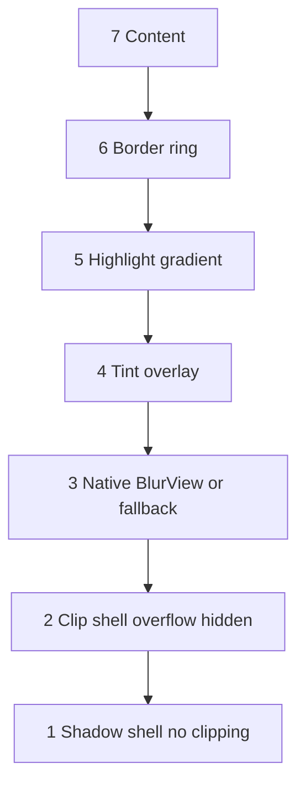
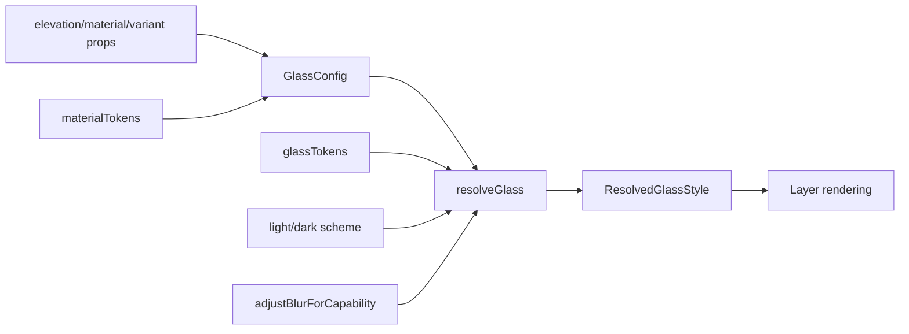
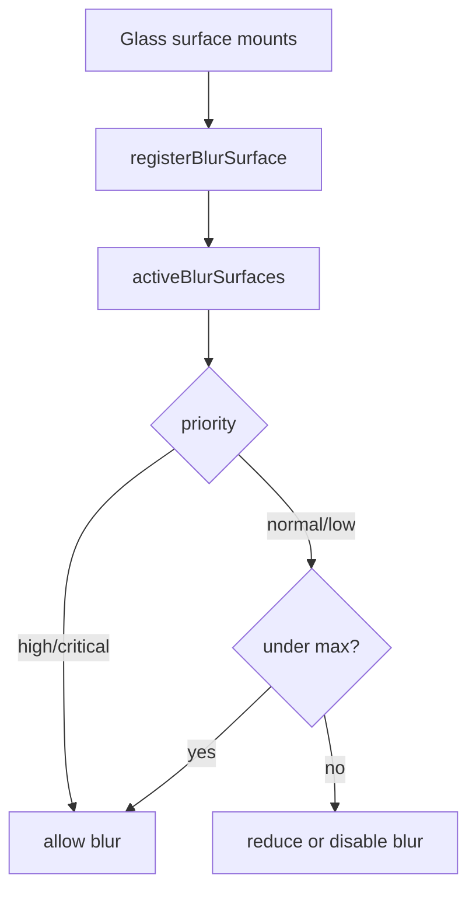
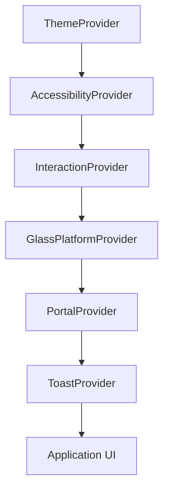

# The ReactNatively Book

The complete engineering book behind ReactNatively: liquid glass rendering, React Native architecture, motion systems, design tokens, package boundaries, and the craft of maintaining a visual framework.

This is not API documentation. It is the story of how the framework thinks.

It starts from first principles, then slowly descends into the actual codebase. By the end, you should not merely know which files to edit. You should understand why those files exist, what constraints shaped them, what can safely change, and what kind of engineer you need to become to evolve the system with taste.

## How To Read This Book

Read it in order the first time.

ReactNatively has several subsystems that look separate when viewed as folders:

- `packages/core`
- `packages/glass`
- `packages/theme`
- `packages/animations`
- `packages/primitives`
- `packages/hooks`
- `packages/utils`
- `apps/playground`
- `web`

But frameworks are not made of folders. They are made of agreements.

The glass engine agrees to degrade when a device cannot blur. The theme engine agrees to express visual intent without hard-coding colors everywhere. The motion system agrees that interaction should be physical but not expensive. The provider graph agrees that application policy should be centralized. The package boundary agrees that users deserve one coherent public API even if maintainers need many internal workspaces.

That is what this book teaches: the agreements.

---

# Part I: Why UI Frameworks Exist

## Chapter 1: A UI Framework Is A Memory System

Most developers first experience a UI framework as a bag of components. There is a `Button`, a `Card`, a `Tabs`, perhaps a `Modal`. You import a thing, pass props, and get pixels.

That view is useful when you are building an app. It is dangerously incomplete when you are building the framework.

A UI framework is a memory system. It remembers decisions so every product screen does not have to remake them:

- how large touch targets should be
- how text responds to dark mode
- how surfaces layer over backgrounds
- how motion should feel
- how blur should degrade on Android
- how a disabled control communicates state
- how overlays escape clipping
- how many expensive visual effects a screen can afford

ReactNatively exists because modern React Native apps often need a visual system that is more alive than flat views, more cinematic than default controls, and more disciplined than one-off glassmorphism snippets. It is a Liquid Glass UI system for React Native and Expo. That phrase matters.

Liquid glass is not just a style. It is a rendering problem.

Premium interaction is not just animation. It is a psychology problem.

Cross-platform React Native is not just TypeScript and JSX. It is a compatibility problem.

Framework maintenance is not just adding components. It is a systems design problem.

ReactNatively solves these problems by treating the UI as a stack of coordinated subsystems. Each subsystem has a narrow responsibility, but together they create a visual identity.

### The First Mental Model

Think of the framework as a small operating system for interface surfaces.

The theme engine is the memory of visual values. The glass engine is the compositor. The animation package is the physics layer. The primitives package is the kernel of reusable behavior. The core package is the public shell. The playground is the lab where the system is forced to show itself under real conditions.



When you understand this stack, you stop asking "where is the button style?" and start asking "which layer owns the decision this button is expressing?"

That question is the beginning of framework engineering.

### Maintainer Note

If you remember one rule from this chapter, remember this: do not let components become the place where every decision accumulates.

Components should express product-facing behavior. They should not secretly become theme engines, animation engines, platform detectors, or native compatibility layers. ReactNatively survives because those responsibilities are separated.

### Exercise

Open `packages/core/src/components/inputs/Button/Button.tsx`. Do not edit it. Read it once and mark every decision it makes:

- size
- color
- press animation
- loading
- disabled state
- glass rendering
- accessibility

Then ask: which decisions belong inside `Button`, and which could eventually move deeper into tokens, primitives, or animation hooks?

You are not trying to refactor yet. You are training your eye.

## Chapter 2: React Native Rendering Is Not Web Rendering

On the web, glass is often a CSS line:

```css
backdrop-filter: blur(20px);
background: rgba(255, 255, 255, 0.72);
```

In React Native, there is no universal `backdrop-filter`. There is no single rendering engine shared by iOS, Android, and web. You are not styling DOM nodes. You are describing native views that will be reconciled by React Native, rendered by platform-specific systems, and constrained by the device's GPU, OS version, native modules, and bridge/runtime architecture.

This changes everything.

React Native UI engineering is a negotiation between JavaScript intent and native capability. You can ask for blur, but the platform may not be able to provide it. You can ask for shadows, but Android and iOS do not interpret shadows the same way. You can animate layout, but if you do it on the JS thread under load, the interaction will feel late. You can draw translucent surfaces, but stack too many of them and the GPU will begin to complain.

ReactNatively's architecture exists because the framework refuses to pretend these problems are not real.

### The Rendering Pipeline, Simplified



When the view is simple, this is invisible. When the view is glass, animated, nested, and translucent, the pipeline becomes part of your design.

### Why Glass Is Hard In React Native

Glass requires seeing through one layer into what is behind it, then blurring or tinting that background, then clipping the result to rounded corners, then preserving shadow outside the clipped region, then drawing content above the material.

That is already difficult on one platform. ReactNatively must do it across:

- iOS, where blur is relatively strong
- Android 12+, where blur can be partial and implementation-dependent
- older Android, where blur may effectively be unavailable
- web through React Native Web or adjacent docs rendering
- Expo apps, where native module availability depends on installation and runtime

This is why ReactNatively has `packages/glass/src/engine/CapabilityDetector.ts`. It is not a decorative helper. It is a statement: rendering begins with capability, not wishful thinking.

### What Happens If You Ignore This

If you build glass as a simple component-local style, you get a UI that works on your simulator and fails somewhere else:

- Android devices show opaque blocks instead of blur.
- Shadows disappear because the same view clips its children.
- Blurred lists drop frames.
- Optional native modules crash at import time.
- Dark mode tints look muddy.
- Nested surfaces become visually noisy.

ReactNatively avoids these failures by making glass a renderer with policy, not a style recipe pasted into every component.

### Exercise

Read `packages/glass/src/components/GlassView/GlassView.tsx` and find the two shells:

- the outer shadow shell
- the inner clip shell

Explain in your own words why they must be separate. If you cannot explain that, you do not yet understand React Native glass rendering.

---

# Part II: The Shape Of ReactNatively

## Chapter 3: The Monorepo As A Map Of Responsibilities

ReactNatively is organized as a pnpm monorepo. The workspace file says:

```yaml
packages:
  - 'packages/*'
  - 'apps/*'
  - 'tooling/*'
```

The root package is private. It owns Turbo scripts, dependency overrides, release commands, and shared engineering policy. The public framework package is not the root. It is `packages/core`, whose package name is `reactnatively`.

This is an important distinction. The repository is the factory. `reactnatively` is the product.

### The Actual Packages



`packages/core` is the public facade. It exports components and re-exports subsystem APIs. Its `package.json` defines the public import paths:

- `reactnatively`
- `reactnatively/glass`
- `reactnatively/hooks`
- `reactnatively/animations`
- `reactnatively/theme`
- `reactnatively/primitives`
- `reactnatively/utils`

This gives consumers a simple mental model:

```tsx
import { Button, GlassView, createTheme } from 'reactnatively';
```

It also gives power users focused entry points:

```tsx
import { resolveGlass } from 'reactnatively/glass';
```

Internally, each subsystem remains independently understandable.

### Why This Split Exists

There are two audiences:

The app developer wants one package.

The framework maintainer wants boundaries.

Those desires conflict. If you publish only one flat package, internals become blurry. If you force users to install seven packages, the framework feels fragmented. ReactNatively resolves this by authoring subsystems as workspace packages while presenting `reactnatively` as the main public API.

This is a mature compromise.

### What Belongs Where

`packages/theme` owns values and meaning. If a change is about the visual language itself, start there.

`packages/glass` owns material rendering. If a change is about blur, tint, highlight, fallback, or capability, start there.

`packages/animations` owns reusable motion mechanics. If a change is about springs, timing, reduced motion, or generic interaction policy, start there.

`packages/primitives` owns reusable UI building blocks. If a change is about a low-level surface, pressable, portal, slot, or accessibility policy, start there.

`packages/core` owns the public component experience. If a change is about `Button`, `Tabs`, `Card`, `Dialog`, or `BottomSheet`, start there.

`packages/hooks` owns shared hooks.

`packages/utils` owns dependency-light helpers.

### The Boundary Rule

When you are tempted to import upward, stop.

`theme` should not import `core`. `glass` should not import `core`. `animations` should not import `core`. Lower-level packages must not know about product-level components. If they do, the architecture becomes circular, and the framework stops scaling.

### Maintainer Note

The existing repository includes a `web/` docs app, but it is not currently part of `pnpm-workspace.yaml`. That means root workspace commands do not automatically include it. Treat this as intentional until changed. If you want root Turbo to own the docs app, add it deliberately and test the consequences.

## Chapter 4: The Public API Is A Promise

Every export is a promise.

The public barrel in `packages/core/src/index.ts` exports layout, typography, inputs, forms, data display, feedback, navigation, overlays, motion, advanced glass, and subsystem APIs.

It also creates aliases:

```ts
export { LiquidCard, LiquidCard as Card } from './components/data-display/Card';
```

That alias is not a casual convenience. It says the framework wants a branded internal identity (`LiquidCard`) and an ergonomic external identity (`Card`). The public API balances poetry and practicality.

### Subpath Exports

The `packages/core/tsup.config.ts` entry list includes:

```ts
entry: [
  'src/index.ts',
  'src/glass.ts',
  'src/hooks.ts',
  'src/animations.ts',
  'src/theme.ts',
  'src/primitives.ts',
  'src/utils.ts',
]
```

This maps to the subpath exports in `packages/core/package.json`. The result is both friendly and tree-shakable.

### The Public API Test

Before exporting anything, ask:

1. Is this stable enough for users to depend on?
2. Is this named semantically rather than by implementation accident?
3. Does exposing it limit future architecture?
4. Does it belong in the main export or only a subpath?
5. Can it be documented with confidence?

Frameworks become hard to evolve when internal conveniences leak into public API.

### Exercise

Pick one export from `packages/core/src/index.ts` that feels like an implementation detail. Write down whether you would keep it public, move it to a subpath, or hide it until it matures.

Do this as a maintainer, not as a user.

---

# Part III: Tokens, Themes, And The Memory Of Design

## Chapter 5: Tokens Are How A Framework Remembers Taste

A design token is not just a variable. It is a preserved design decision.

ReactNatively's tokens live in `packages/theme/src/tokens`:

- `colors.ts`
- `glass.ts`
- `materials.ts`
- `motion.ts`
- `radii.ts`
- `shadows.ts`
- `spacing.ts`
- `typography.ts`

Together, they give the framework a stable visual grammar.

Without tokens, every component becomes a tiny design system. One button chooses `12px`, another chooses `14px`, one card uses `rgba(255,255,255,0.7)`, another uses `rgba(255,255,255,0.8)`, and eventually the product feels like a collage.

Tokens prevent entropy.

### Primitive Versus Semantic

`packages/theme/src/tokens/colors.ts` defines `palette`. The file itself warns maintainers:

```ts
// PRIMITIVE PALETTE — never reference directly in components, use semantic tokens
```

That comment matters. Primitive colors are raw material. Semantic colors are meaning.

`palette.indigo[500]` is a color.

`theme.colors.primary` is an intention.

When a component uses semantic colors, it survives dark mode, brand overrides, high-contrast futures, and visual redesigns. When it imports primitive palette values directly, it becomes a fossil.

### The Base Theme

`packages/theme/src/themes/base.ts` assembles the complete `BaseTheme`:

```ts
export interface BaseTheme {
  colors: ThemeColors;
  glass: typeof glassTokens;
  spacing: typeof spacing;
  radii: typeof radii;
  typography: typeof typography;
  shadows: typeof shadows;
  motion: typeof motion;
  materials: typeof materialTokens;
  states: typeof stateTokens;
  zDepth: typeof zDepth;
  breakpoints: typeof breakpoints;
  density: typeof density;
  accessibility: typeof accessibilityTokens;
  haptics: typeof hapticTokens;
  components: typeof componentTokens;
}
```

Notice that glass, motion, accessibility, haptics, and component defaults are all part of the theme. This is the correct direction for a framework whose identity is not only color. ReactNatively's theme is a system of behavior and material, not merely a palette.

### Theme Runtime

`packages/theme/src/ThemeProvider.tsx` resolves theme state:

1. Read the system color scheme.
2. Apply explicit preference: `light`, `dark`, or `system`.
3. Start with `baseTheme`.
4. Replace colors with `darkColors` when needed.
5. Apply user overrides using `deepMerge`.



The merge order is a contract. User overrides win. If you change that, you change the framework's customization semantics.

### The Token Flow Through A Component

Look at `Button`. It does not import `palette`. It calls `useTheme()` and resolves semantic values:

```ts
const c = theme.colors;
primary: {
  bg: c.primary,
  bgHover: c.primaryHover,
  bgTinted: c.primaryMuted,
  textOnBg: '#fff',
  border: c.primary,
}
```

There is still room to improve this by moving more of the button recipe into theme-level component tokens. But the current code already follows the essential principle: public components consume semantic theme values.

### What Happens If Tokens Break

If a token is wrong, the error propagates widely. That is both dangerous and powerful.

Change `glassTokens.elevation[3].blur`, and every elevation-3 glass surface changes. That is exactly why tokens should be edited carefully. They are small files with large blast radius.

### Maintainer Note

A token should be added when multiple components need a shared concept or when the value expresses framework identity. Do not add tokens for one-off implementation details. Token systems can become junk drawers if every local number becomes global.

### Exercise

Add an imaginary `opacity` token family on paper:

```ts
export const opacity = {
  disabled: 0.45,
  pressed: 0.88,
  overlay: 0.56,
}
```

Now ask:

- Is this primitive or semantic?
- Should it live in its own file?
- Should `stateTokens.disabled.opacity` remain the source instead?
- Which components would consume it?

The purpose is not to add code. The purpose is to learn how tokens earn their place.

## Chapter 6: Materials Are Higher-Level Than Colors

Glass cannot be described by color alone. A material has depth, translucency, edge treatment, highlight, shadow, and sometimes behavior under load.

ReactNatively's material recipes live in `packages/theme/src/tokens/materials.ts`:

```ts
export const materialTokens = {
  thin: { elevation: 1, variant: 'thin', ... },
  regular: { elevation: 2, variant: 'surface', ... },
  thick: { elevation: 3, variant: 'elevated', ... },
  chrome: { elevation: 4, variant: 'overlay', ... },
  hud: { elevation: 4, variant: 'frosted', ... },
  panel: { elevation: 2, variant: 'surface', ... },
  bar: { elevation: 3, variant: 'thin', ... },
  popover: { elevation: 4, variant: 'elevated', ... },
  sheet: { elevation: 5, variant: 'overlay', ... },
}
```

This is where ReactNatively begins to feel like a rendering system rather than a style library.

When a component says `material="panel"`, it is not asking for a color. It is asking for a role in the interface. A panel should sit differently from a popover. A sheet should feel heavier than a bar. A HUD should feel vivid and present.

### Why Materials Matter Emotionally

Interfaces are spatial illusions. Users understand them by reading hierarchy: what is background, what is active, what is floating, what is temporary, what is interactive.

Translucency changes hierarchy because it lets context remain visible. A sheet over content feels less like a wall and more like a layer. A floating dock feels less like a rectangle and more like an object. A glass tab feels selected not only because of color, but because it has acquired material presence.

That is the emotional role of the material system.

### Engineering Tradeoff

The risk of materials is overuse. If every component becomes a heavy glass object, nothing feels special, and performance suffers. The material system gives you vocabulary, but taste decides when to speak.

### Exercise

Open `packages/theme/src/tokens/materials.ts`. Choose `bar`, `popover`, and `sheet`. Explain why their elevation values differ. Then find where those material roles are used or could be used in navigation and overlay components.

---

# Part IV: The Glass Engine

## Chapter 7: Glass Begins With Humility

The first job of a renderer is not to render. It is to ask what is possible.

ReactNatively's glass engine begins in `packages/glass/src/engine/CapabilityDetector.ts`:

```ts
export type GlassCapability = 'full' | 'partial' | 'none';
```

The detector says:

- iOS gets `full`
- Android 31+ gets `partial`
- web gets `partial`
- everything else gets `none`

This is not pessimism. It is respect for the platform.

Frameworks fail when they confuse the maintainer's device with the user's device. A glass UI that only works beautifully on a modern iPhone is not a framework. It is a demo.

### Capability-First Rendering



`adjustBlurForCapability` is the first degradation:

```ts
if (GLASS_CAPABILITY === 'full') return intensity;
if (GLASS_CAPABILITY === 'partial') return Math.round(intensity * 0.65);
return 0;
```

Later, `GlassPlatformProvider` applies runtime policy. The two-stage model is important:

- capability answers "what can this platform do?"
- policy answers "what should this app do right now?"

### What Would Happen Without Capability Detection

Without capability detection, old Android devices could try to render expensive or unsupported blur. Missing native modules could crash. The framework would either force every consumer to handle platform logic or ship inconsistent visuals.

Centralizing this decision makes every glass component safer.

### Maintainer Note

Capability detection must stay boring. Avoid clever heuristics unless they are measured and necessary. The detector should be easy to reason about because the entire renderer trusts it.

## Chapter 8: The Layer Stack Of `GlassView`

`GlassView` is the foundational renderer. It lives in:

```text
packages/glass/src/components/GlassView/GlassView.tsx
```

Its comment tells the truth:

```text
Layer stack (bottom -> top):
  1. Shadow shell
  2. Clip shell
  3. BlurView
  4. Tint overlay
  5. Highlight
  6. Border ring
  7. Content
```

This is the most important rendering diagram in the framework.



The order is not arbitrary.

The shadow must live outside the clipped layer, or shadows are cut off. The blur and tint must live inside the clipped layer, or rounded corners leak. The content must be above the material layers, or the component becomes unreadable. The border must sit above tint to define the edge. The highlight must sit above tint because it simulates refraction at the surface edge.

### Optional Native Modules

`GlassView` lazily loads:

- `expo-blur`
- `react-native-linear-gradient`

It does so with guarded `require` calls:

```ts
try {
  BlurViewImpl = require('expo-blur').BlurView;
} catch {
  BlurViewImpl = null;
}
```

This is a framework-grade decision. Optional visual fidelity should not become mandatory installation pain. If blur is missing, the surface still renders with tint, highlight, border, and content.

### The Fallback Path

When `IS_NO_GLASS` is true or blur resolves to zero, `GlassView` renders a no-blur version:

- shadow shell
- clipped tint
- optional highlight
- optional border
- content

This fallback is not a degraded afterthought. It is part of the renderer. A fallback should still feel designed.

### The Outer Shell Problem

React Native shadows and clipping are uneasy neighbors. If you put `overflow: 'hidden'` on the same view that owns the shadow, the shadow may be clipped. If you do not clip, the glass layers ignore rounded corners.

ReactNatively solves this with two shells:

```text
View shadowShell
  View clipShell overflow hidden
    Blur/tint/highlight/border/content
```

This is a small architectural detail with large visual consequences.

### Debugging Scenario: The Card Has No Rounded Blur

Suppose a glass card's blur appears rectangular even though the card radius is 20.

Check:

1. Is `borderRadius` passed to `GlassView`?
2. Is the radius applied to the clip shell?
3. Is some child layer absolute-filled outside the clipped shell?
4. Is a parent applying transforms or clipping unexpectedly?

Do not immediately edit the card. First inspect the renderer.

### Exercise

Temporarily imagine removing the tint overlay. What would happen to readability over bright backgrounds? Now imagine removing the highlight. What would happen to perceived material? Write down the difference between optical correctness and product usefulness.

## Chapter 9: Resolving Glass From Intention To Pixels

The pure resolver lives in `packages/glass/src/engine/GlassEngine.ts`.

It accepts `GlassConfig` and a color scheme, and returns `ResolvedGlassStyle`.

Inputs include:

- elevation
- variant
- highlight
- border
- blur override
- tint override

Outputs include:

- blur amount
- blur tint
- tint color
- highlight color
- border color
- shadow props
- Android elevation
- capability

This resolver is intentionally pure. It does not call hooks. It does not load native modules. It does not know which component will render the style. That purity is what makes it reusable by `useGlassStyle` and `GlassView`.

### Why Pure Resolution Matters

When a system has visual bugs, you need places where cause and effect are clear. `resolveGlass` is one of those places. Given the same config and color scheme, it should return the same result.

If you put runtime side effects inside this function, debugging becomes harder. If you make it depend on component state, custom glass components become unpredictable.

### Token Flow



### Overrides

`blurOverride` and `tintOverride` exist for escape hatches. They bypass part of the token system.

Use them carefully. Overrides are useful for custom effects, demos, and debugging. They are dangerous if they become normal component implementation because they weaken the material system.

### Maintainer Note

If you add a new visual concept to glass, decide whether it belongs in:

- `GlassConfig`
- `ResolvedGlassStyle`
- `glassTokens`
- `materialTokens`
- `GlassView` render layers

Do not skip this modeling step. Bad rendering APIs are hard to remove.

## Chapter 10: Blur Budgeting And GPU-Aware Design

Glass is not free.

Every blur surface asks the renderer to sample and process pixels behind it. On complex screens, especially scrolling screens, this can become expensive. ReactNatively treats blur as a budgeted resource.

The budget lives in `packages/glass/src/engine/GlassMaterialProvider.tsx`.

Default policy:

```ts
const defaultMaterial = {
  quality: 'balanced',
  powerMode: 'normal',
  tintDensity: 1,
  reduceTransparency: false,
  nestedGlassIntensity: 0.72,
};

const defaultBudget = {
  maxBlurSurfaces: 8,
  degradeStrategy: 'reduce-all-blur',
};
```

### The Budget Mental Model

Imagine a screen with:

- a glass navbar
- a floating dock
- six glass cards
- a modal
- a toast

Each one may ask for blur. The GPU does not care that they are beautiful. It only cares about work.

The budget provider tracks active blur surfaces and decides whether a surface can use blur. High and critical priority surfaces can bypass the normal budget because some UI layers matter more than others.



### Quality Scalars

`adjustBlur` applies:

- quality scalar
- power scalar
- budget scalar

This gives the framework a single policy point for visual performance.

### Performance Pitfall: Glass Lists

The worst naive use of glass is a large scrolling list where every row is a blurred surface. It may look good in a screenshot and feel terrible in a hand.

Better approaches:

- use glass only for selected or floating items
- use solid `Surface` for repeated rows
- lower list item priority
- reduce provider quality on heavy screens
- memoize row components
- avoid animating blur

### Debugging Scenario: Scrolling Jank On Android

If a screen janks:

1. Count visible `GlassView`s.
2. Check `GLASS_CAPABILITY`.
3. Lower `glass.material.quality` to `efficient`.
4. Reduce `maxBlurSurfaces`.
5. Replace repeated glass with solid surfaces.
6. Verify animations are Reanimated-driven, not React state-driven.

### Future Evolution Idea

The current budget counts mounted blur surfaces. A more advanced engine could account for:

- visible viewport only
- surface area
- animation state
- platform/device performance class
- battery saver
- nested blur depth

Do not build this prematurely. But design current APIs so this future remains possible.

---

# Part V: Motion, Psychology, And The UI Thread

## Chapter 11: Motion Is Meaning

Motion is not decoration. It tells the user what happened.

A button that compresses under the finger says "I received your touch." A sheet that rises with spring tension says "this layer came from below." A tab indicator sliding or fading says "state changed here." A glass card scaling slightly says "this object is tactile."

Motion changes perception because it gives the interface continuity. Without motion, state changes can feel like cuts. With too much motion, the interface feels slow or theatrical. Good motion is felt more than noticed.

ReactNatively's motion system starts in tokens:

```text
packages/theme/src/tokens/motion.ts
```

Then becomes Reanimated presets:

```text
packages/animations/src/presets/spring.ts
packages/animations/src/presets/timing.ts
```

Then becomes hooks and policies:

```text
packages/animations/src/hooks/usePressAnimation.ts
packages/animations/src/hooks/useEntranceAnimation.ts
packages/animations/src/InteractionProvider.tsx
```

Then becomes components:

```text
packages/core/src/components/motion
```

### Springs As Personality

The framework defines springs:

- `snappy`
- `liquid`
- `reveal`
- `bounce`
- `precise`

These names are not arbitrary. They encode motion intent.

`snappy` is for fast, confident UI response.

`liquid` is for glass and cards, where physicality matters.

`reveal` is for dialogs and entering surfaces.

`bounce` is expressive and should be used sparingly.

`precise` is for controls where overshoot would feel wrong.

### The Interaction Provider

`packages/animations/src/InteractionProvider.tsx` defines global interaction policy:

```ts
export interface InteractionPolicy {
  intensity: 'subtle' | 'standard' | 'expressive';
  enableHaptics: boolean;
  pressScale: number;
  pressOpacity: number;
  defaultSpring: keyof typeof springs;
  reduceMotion?: boolean;
}
```

This makes interaction adjustable without rewriting every component. The same component can feel restrained in a productivity app or more expressive in a media app.

### UI Thread Thinking

Reanimated shared values allow visual updates to run on the UI thread. This is essential for press feedback and transitions that must remain responsive when JavaScript is busy.

Good:

```ts
const pressed = useSharedValue(0);

const animatedStyle = useAnimatedStyle(() => ({
  transform: [{ scale: interpolate(pressed.value, [0, 1], [1, 0.96]) }],
}));
```

Risky:

```ts
const [pressed, setPressed] = useState(false);
```

React state is not wrong for state. It is wrong for high-frequency frame-by-frame visual state.

### Reduced Motion

`packages/animations/src/hooks/useReducedMotion.ts` delegates to Reanimated's reduced motion hook and maps spring/duration tokens to reduced equivalents.

Reduced motion is not an optional kindness. It is accessibility infrastructure. Motion that creates delight for one person can create discomfort for another.

### Maintainer Note

Some current core components still implement direct animation instead of using shared hooks. That is acceptable in a growing framework, but the direction should be consolidation. Repeated animation code becomes repeated inconsistency.

### Exercise

Compare `GlassPressable` and `Button`.

`GlassPressable` uses `usePressAnimation`.

`Button` implements press animation directly with `useSharedValue`, `useAnimatedStyle`, and `withSpring`.

Write down what would need to change for `Button` to use the shared hook without losing its current behavior.

## Chapter 12: Gestures, Presses, And Tactility

Interaction has layers:

- visual feedback
- haptic feedback
- semantic accessibility state
- disabled/loading protection
- gesture tracking

`GlassPressable` in `packages/primitives/src/GlassPressable/GlassPressable.tsx` is the primitive expression of this idea.

Its structure:

```text
Pressable
  Animated.View
    Surface
      children
```

The `Pressable` owns user input. The `Animated.View` owns motion. The `Surface` owns rendering. Children own content.

This layering is clean because each layer has a reason to exist.

### Haptics As Optional Enhancement

`GlassPressable` optionally loads `expo-haptics`. If the dependency is missing, haptics become a no-op. This matches the same philosophy as optional blur:

The framework should become richer when optional native capabilities exist, not fragile when they do not.

### Magnetic Pressable

`MagneticPressable` measures its position and pulls toward the finger. It stores layout in a ref:

```ts
const layoutRef = useRef({ width: 0, height: 0, pageX: 0, pageY: 0 });
```

This avoids re-rendering on movement. The motion is driven by shared values.

### Common Mistake

Do not attach expensive work to press movement. Pointer movement can fire often. If you set React state on every move, the component will feel sticky under load.

### Exercise

Design a `GlassSlider` mentally. Which layer owns the drag gesture? Which layer owns the animated thumb? Which layer owns the track material? Which values belong in tokens?

---

# Part VI: Primitives And Components

## Chapter 13: Primitives Are Where Reuse Becomes Architecture

A primitive is not a small component. A primitive is a reusable architectural decision.

ReactNatively's primitives live in `packages/primitives`:

- `Surface`
- `GlassPressable`
- `GlassText`
- `Portal`
- `Slot`
- `AccessibilityProvider`

These are not glamorous, but they keep the framework coherent.

### `Surface`

`Surface` is the unified rendering primitive:

1. If `glass` is true or a glass config, render `GlassView`.
2. Otherwise render a normal `View`.
3. If `animated` is true, wrap in `Animated.View`.

This lets higher-level components support glass and solid modes without copying renderer logic.

Important detail: hooks are called unconditionally before branching. That is React discipline. Conditional hooks are how abstractions become haunted.

### `Portal`

Overlays need to escape local stacking and clipping. React Native does not have DOM portals in the same way the web does, so ReactNatively implements a portal registry.

`PortalProvider` keeps:

```ts
entries: { key, element }[]
```

It renders them in a full-screen host above children.

This supports modals, toasts, sheets, and future overlay systems.

### `Slot`

`Slot` enables `asChild` composition. It renders a single child while merging props and composing handlers.

This is an advanced primitive because it lets components delegate rendering without introducing extra wrapper views.

### Maintainer Note

A primitive should be boring to use and hard to misuse. If a primitive requires many rules in every consumer, the abstraction is not finished.

## Chapter 14: Components As Public Architecture

Components are where framework philosophy becomes user experience.

A ReactNatively component should:

- consume semantic tokens
- respect provider policy
- use primitives where possible
- expose stable semantic props
- handle accessibility state
- avoid duplicating renderer logic
- degrade gracefully

### Button

`packages/core/src/components/inputs/Button/Button.tsx`

Button combines:

- size variants through `defineVariants`
- semantic color resolution through `useTheme`
- Reanimated press animation
- loading state
- disabled state
- glass variant through `GlassView`
- accessibility role/state

The component is practical and direct. It is also a good example of a component that could later become more recipe-driven.

### Card

`LiquidCard` is a compound component:

- `LiquidCard`
- `LiquidCard.Header`
- `LiquidCard.Body`
- `LiquidCard.Footer`
- `LiquidCard.Image`

The card root renders `GlassView`. The subcomponents encode common spacing and border behavior. Compound components are useful when structure matters more than a long list of props.

### Tabs

`Tabs` uses internal context:

- root stores controlled/uncontrolled state
- list handles layout variant
- tab handles selection and animation
- panel renders only active content

Glass is applied selectively. In `variant="glass"`, the active tab gets material presence. That is better than making the entire tabs system heavy by default.

### Avatar

`Avatar` is deliberately not glass. It resolves image, initials, deterministic color, and status indicator.

This is a lesson in restraint. A liquid-glass-first framework does not need every component to be glass. Identity comes from consistent use of materials where they add hierarchy, not from visual saturation.

### Component Creation Pattern

Most components should follow:

```text
Component/
  Component.tsx
  Component.types.ts
  index.ts
```

Then export through `packages/core/src/index.ts`.

### Exercise

Build a mental `CommandItem` component:

- Is it a primitive or core component?
- Should it use `Surface`, `GlassPressable`, or plain `Pressable`?
- What accessibility role does it need?
- What tokens should define selected and disabled states?
- Which animation should it use when highlighted?

Do not code yet. Architecture begins before typing.

---

# Part VII: Providers, Accessibility, And Application Policy

## Chapter 15: Provider Architecture Is Policy Architecture

`ReactnativelyProvider` lives in:

```text
packages/core/src/providers/ReactnativelyProvider.tsx
```

It composes:

```tsx
<ThemeProvider>
  <AccessibilityProvider>
    <InteractionProvider>
      <GlassPlatformProvider>
        <PortalProvider>
          <ToastProvider>{children}</ToastProvider>
        </PortalProvider>
      </GlassPlatformProvider>
    </InteractionProvider>
  </AccessibilityProvider>
</ThemeProvider>
```

This graph is not arbitrary.

Theme is outermost because nearly everything consumes it. Accessibility is high because visual and interaction choices may depend on it. Interaction wraps glass and content because motion is global behavior. Glass policy wraps content because surfaces need one shared budget. Portal wraps children because overlays need a host. Toast provider is optional application service.

### Provider Order Diagram



### What Happens If Provider Order Breaks

If `GlassPlatformProvider` is duplicated in subtrees, blur budget becomes fragmented.

If `ThemeProvider` is moved inward, components outside it crash when calling `useTheme`.

If portals sit outside theme or interaction providers, overlays may not inherit visual policy.

Provider order is architecture.

### Accessibility Provider

`AccessibilityProvider` owns:

- minimum touch target
- font scaling policy
- max font size multiplier
- reduce transparency

It exposes `touchTargetStyle` and `textProps`.

The framework currently has some tension: several text components set `allowFontScaling={false}` for visual control. Long-term, this should be reconciled with accessibility policy so apps can choose strict or adaptive text behavior deliberately.

### Reduced Transparency

Accessibility policy includes `reduceTransparency`. Glass material policy also includes `reduceTransparency`.

Today those are separate. A future improvement could wire accessibility reduced transparency into glass policy inside `ReactnativelyProvider`, so one user-facing accessibility preference automatically disables blur. If you do this, document it because it changes rendering semantics.

### Maintainer Note

Providers are tempting places to add global knobs. Be careful. Every provider prop becomes framework policy. Add a provider setting only when the decision genuinely needs to be global.

---

# Part VIII: Packaging, Expo, And Distribution

## Chapter 16: Expo Compatibility Is A Design Constraint

ReactNatively is built for React Native and Expo. Expo compatibility is not a marketing checkbox; it shapes implementation.

The framework avoids custom native modules in its core. It treats native enhancements like blur, gradient, and haptics as peer or optional capabilities. The playground app uses Expo configuration:

```js
presets: ['babel-preset-expo'],
plugins: ['react-native-reanimated/plugin'],
```

Reanimated's plugin is essential. If animations fail in a consuming app, check Babel before blaming the component.

### Metro Singleton Resolution

`apps/playground/metro.config.js` pins singleton modules:

- `react`
- `react-native`
- `react-native-reanimated`
- `reactnatively`

This prevents multiple React Native or React copies in a monorepo. Duplicate React instances cause invalid hook calls, broken contexts, and strange runtime behavior.

### Build Strategy

Every package uses tsup. Packages emit:

- CJS
- ESM
- declaration files
- sourcemaps

Packages mark:

```json
"sideEffects": false
```

This supports tree shaking. But tree shaking is not magic. It depends on disciplined module design:

- avoid expensive top-level work
- expose ESM
- keep optional native `require` calls guarded
- preserve subpath entries
- avoid barrels that import heavy modules unnecessarily

### Internal Packages Bundled Into Core

`packages/core/tsup.config.ts` externalizes native peers like `react`, `react-native`, `expo-blur`, `react-native-reanimated`, and bundles internal workspace packages into `reactnatively`.

This lets users install one framework package while still letting maintainers work in separated packages.

### Maintainer Note

Dependency changes in React Native frameworks are high-risk. Adding a dependency is not just adding code. It affects Metro, Expo, native compatibility, install size, tree shaking, and peer version conflicts.

---

# Part IX: Maintaining The Framework

## Chapter 17: Debugging As Systems Reading

Framework debugging is rarely about one line. It is about following the flow of meaning through layers.

### Debugging Glass

Start with:

1. `GLASS_CAPABILITY`
2. installed optional modules
3. provider material policy
4. blur budget
5. material token
6. `resolveGlass` output
7. `GlassView` render branch
8. parent layout/clipping

If blur is missing, do not start by changing `Button`. Start with the renderer.

### Debugging Motion

Start with:

1. Reanimated Babel plugin
2. duplicate Reanimated versions
3. reduced motion setting
4. shared value updates
5. animated style attachment
6. worklet-safe closures

If a press animation feels late, ask whether it is JS-thread state or UI-thread shared values.

### Debugging Theme

Start with:

1. resolved color scheme
2. `baseTheme`
3. `darkColors`
4. user override
5. component semantic usage
6. primitive palette leaks

If a color is wrong in dark mode, check merge order before rewriting component styles.

### Debugging Package Exports

Start with:

1. local component `index.ts`
2. package `src/index.ts`
3. core barrel
4. subpath entry file
5. tsup entry
6. package `exports`
7. generated `dist`

Export bugs are often missing links in a chain.

## Chapter 18: Evolving Without Breaking The Soul

Frameworks age in two ways.

They grow features, and they accumulate compromises.

The job of a maintainer is not to prevent change. It is to make change pass through the right layers.

### Safe Evolution Principles

Keep visual identity token-driven.

Keep rendering capability-aware.

Keep motion reusable and reduced-motion-compatible.

Keep components semantic.

Keep public API small enough to defend.

Keep optional dependencies optional unless there is a clear reason.

Keep platform-specific decisions centralized.

### Common Maintainer Mistakes

Adding a prop because one screen needs it.

Hard-coding a color because it looks right today.

Animating blur because it looks impressive in a demo.

Using React state for per-frame motion.

Adding a package dependency to solve a small local problem.

Exporting internals before they are stable.

Letting every component implement press behavior differently.

Forgetting old Android.

Forgetting accessibility.

### Reviewing Pull Requests

Ask:

- Which layer owns this decision?
- Does the change preserve fallback behavior?
- Does it respect theme semantics?
- Does it introduce public API?
- Does it affect bundle size?
- Does it work in Expo?
- Does it work without optional peers?
- Does it preserve reduced motion?
- Does it increase blur surfaces?
- Does the playground demonstrate it?

PR review is not gatekeeping. It is architectural memory.

## Chapter 19: Future Architecture

ReactNatively already has the bones of a serious framework. The future work is to make those bones stronger.

### Recipe-Driven Components

`createRecipe` exists but many components still resolve variants manually. Over time, mature components can move toward recipes:

- variants
- sizes
- states
- material defaults
- tokenized styles

This would reduce duplication and make theming deeper.

### Accessibility Integration

The accessibility provider should become more consistently consumed:

- text scaling policy
- reduced transparency
- min touch targets
- contrast adaptation
- role/state helpers

### More Intelligent Glass Budgeting

The current budget counts mounted surfaces. Future versions could consider:

- visible area
- viewport intersection
- device class
- battery mode
- nested glass
- scroll velocity

### Motion Consolidation

High-level components should increasingly consume `packages/animations` hooks instead of duplicating direct animation logic.

### Documentation As Architecture

The `web/` docs app should eventually teach the same mental models as this book, but interactively:

- live glass budget demos
- token inspectors
- motion playground
- platform fallback examples
- component anatomy pages

Good docs are not a side project. They are how a framework teaches people to use it without damaging it.

---

# Part X: Practical Apprenticeship

## Chapter 20: Exercises For Becoming Independent

These exercises are designed to turn reading into ownership.

### Exercise 1: Trace A Glass Button

Start at:

```tsx
<Button variant="glass" label="Continue" />
```

Trace:

1. `Button` props
2. size config
3. color resolution
4. press animation
5. `GlassView`
6. material/elevation/variant
7. `resolveGlass`
8. capability adjustment
9. provider budget adjustment
10. rendered layers

Write the story in your own words.

### Exercise 2: Add A New Glass Material

Goal: add `floating`.

Steps:

1. Add `floating` to `materialTokens`.
2. Choose elevation and variant intentionally.
3. Decide border/highlight/shadow.
4. Use it in one advanced glass component.
5. Verify fallback rendering.
6. Add playground example.

Do not expose it widely until it has a clear role.

### Exercise 3: Refactor Button Press Motion

Goal: make `Button` use `usePressAnimation`.

Constraints:

- preserve disabled/loading behavior
- preserve glass and non-glass variants
- preserve accessibility state
- preserve Reanimated UI-thread motion
- avoid public API change

This teaches how to consolidate without changing behavior.

### Exercise 4: Build A New Component

Build `GlassBadge`.

Questions:

- Is it core or primitive?
- Is it interactive?
- Should it use `Surface` or `GlassView`?
- Which semantic colors should it use?
- Does it need accessibility label support?
- Should it animate when appearing?

Implement only after answering.

### Exercise 5: Design A Reduced Transparency Mode

Goal: connect `accessibility.reduceTransparency` to glass policy.

Plan:

1. Read `ReactnativelyProvider`.
2. Read `AccessibilityProvider`.
3. Read `GlassPlatformProvider`.
4. Decide precedence if both accessibility and glass props define transparency.
5. Implement derived material policy.
6. Document the behavior.
7. Test with glass surfaces.

This teaches provider policy design.

### Exercise 6: Diagnose A Slow Screen

Create or inspect a screen with many cards.

Measure:

- number of `GlassView`s
- which are high priority
- whether blur budget is exceeded
- whether repeated rows need real blur
- whether animations are UI-thread safe

Then optimize without changing public component APIs.

### Exercise 7: Add A Public Export

Pick a private component and pretend it should become public.

Trace the full export path:

1. component local `index.ts`
2. category export
3. `packages/core/src/index.ts`
4. subpath if needed
5. type export
6. tsup entry
7. docs

This teaches distribution discipline.

---

# Epilogue: The Taste Of A Framework

ReactNatively is not valuable because it has glass.

Glass can be copied.

It is valuable because it tries to make glass responsible: tokenized, adaptive, budgeted, accessible, and integrated with motion. It is valuable because it treats React Native not as a limitation to ignore, but as a platform with real rendering constraints. It is valuable because it understands that interfaces are emotional objects as much as technical objects.

A good UI framework gives users components.

A great one gives maintainers a way to think.

The way to evolve ReactNatively is not to add more effects until the system becomes loud. It is to deepen the agreements:

- materials should have meaning
- motion should communicate
- fallbacks should feel designed
- tokens should preserve taste
- providers should express policy
- primitives should prevent duplication
- components should be semantic
- packages should protect boundaries
- public APIs should be promises worth keeping

When you can look at a proposed change and feel which layer it belongs to, you are no longer just editing the framework.

You are maintaining its philosophy.
